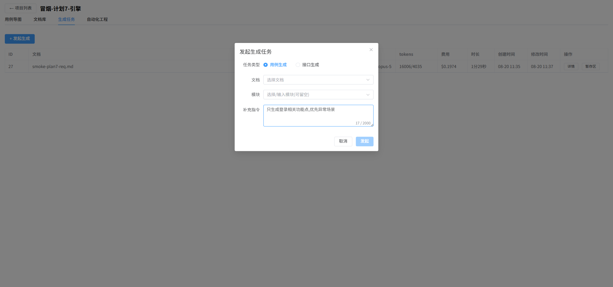
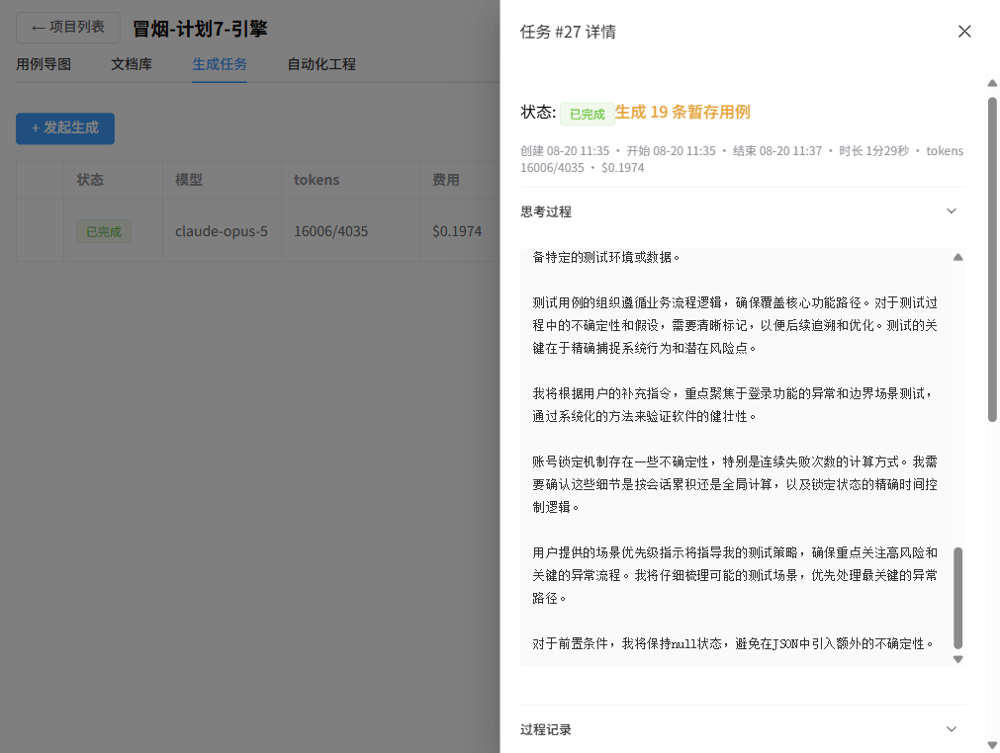
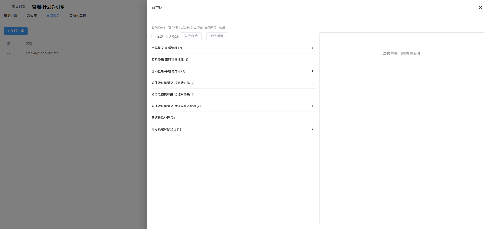
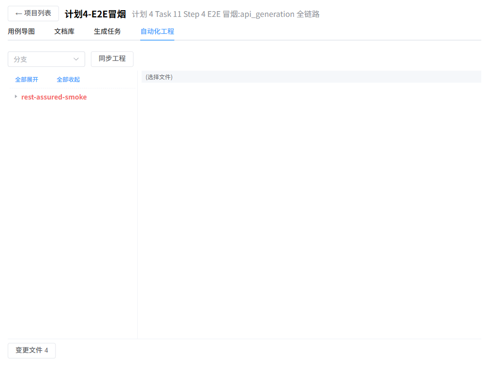

# light_tester_frontend

AI 测试平台 **Light Tester** 前端:测试项目与用例树管理(思维导图视图)、AI 生成任务发起与实时进度、暂存区用例裁决、自动化工程(Git 仓库)浏览与推送。

配套后端:[light_tester_backend](../backend)(FastAPI + MySQL + claude-agent-sdk 生成引擎)。

技术栈:Vue 3 + TypeScript + Vite + Element Plus + simple-mind-map(导图画布)+ Monaco Editor(代码浏览)。

## 功能截图

| 项目列表 | 文档库 |
|---|---|
|  |  |

| 发起生成(可选补充指令) | 生成任务列表 |
|---|---|
|  |  |

| 任务详情(思考过程 + 过程记录) | 暂存区(按功能点裁决) |
|---|---|
|  |  |

| 用例导图(树形编辑/xmind 导入导出) | 自动化工程(文件树/变更/推送) |
|---|---|
|  |  |

## 平台功能使用流程

1. **建项目**:项目列表新建项目;接口自动化类项目在「编辑」里填写 GitLab 仓库地址与访问 Token。
2. **传文档**:进入项目 →「文档库」上传 Markdown 需求文档(功能用例生成)或 API 文档(接口脚本生成)。
3. **发起生成**:「生成任务」→「+ 发起生成」→ 选任务类型(case_generation / api_generation)、文档、目标模块(可留空),可填**补充指令**聚焦生成范围(如「只测登录,优先异常场景」)。
4. **看进度**:任务行点「详情」,抽屉实时直播 AI 的思考摘要、叙述文本与**过程记录**(引擎的工具调用流水,如读了哪个技能文件、跑了什么命令);终态后随时回看,费用与 tokens 一并展示。
5. **功能用例 → 暂存区**:任务完成后点「暂存区」,按功能点分组勾选 → 入库(进用例树)/ 拒绝(删除)。
6. **用例导图**:左侧用例树在导图上按「模块 → 功能点 → 用例」组织,支持改名/改优先级/改执行结果、xmind 导入导出、Excel 导出。
7. **接口脚本 → 自动化工程**:api_generation 产物直接写入仓库 working copy(Java 测试类全文),mvn 编译不过会自动进入修复轮;「自动化工程」tab 可切分支、看变更(红)/干净(绿)、浏览文件(Monaco),勾选变更后推送到 GitLab。

## 启动

```bash
# 1. 先起后端(见 ../backend/README.md,端口 8000)
npm i
npm run dev        # http://localhost:5173,/api 由 vite proxy 转发到 8000
```

## 测试

```bash
npx vitest run --pool=threads    # 73 条;forks 池在本机不稳,务必用 threads 池
npm run build                    # 类型检查 + 构建
```

## 架构速览

- `src/api/` — 后端契约类型与 fetch 封装(ApiError 带 status/detail);类型与后端 pydantic 模型一一对应
- `src/adapters/tree.ts` — 后端树(平行数组)→ 导图树(单链 children)纯函数
- `src/components/MindmapEditor.vue` — simple-mind-map 画布封装(容器有尺寸才初始化,隐藏 tab 下挂载由 ResizeObserver 兜底)
- `src/components/JobsPane.vue` — 生成任务列表/发起弹窗/详情抽屉(SSE 直播 thinking/delta/tool/进度/终态 snapshot 回放)
- `src/components/RepoPane.vue` / `PushDialog.vue` — 自动化工程文件树、变更推送
- `src/views/` — HomeView(项目 CRUD,卡片墙)、ProjectView(工作台:导图/文档库/生成任务/自动化工程四 tab)

## 手动冒烟清单(发版自查)

1. 新建项目 → 进入 → 工具栏建根模块 → 选中加子模块/功能点 → 功能点下加用例
2. 选中三类节点 → 侧边表单分别改名/改字段保存 → 画布文本同步刷新
3. 用例:改优先级/执行结果 → 画布前缀 `[P0]`/`✓`/`✗` 变化;步骤空行保存被拦
4. 模块移动:改父模块 → 节点迁到目标下;选自己后代被后端 400 拒绝
5. 删除模块 → 整个子树消失
6. 文档库:拖拽上传 .md → 列表出现 → 下载一致 → 上传 .txt 被拦 → 删除
7. 导出 .xmind → XMind(2020+)打开:层级/优先级旗帜/notes(前置/步骤/执行结果)正确;中文项目名文件名不乱码
8. 上传 .md → 发起生成(带补充指令)→ SSE 看 thinking/delta/tool 流式输出 → 完成后暂存区出现分组用例
9. 勾选部分用例 → 入库 → 用例导图出现新功能点/用例;拒绝的消失
10. 导出 Excel:三个工作表(测试概述/功能点清单/测试用例)内容正确
11. 接口项目:自动化工程 tab 同步 → 变更红/干净绿 → 浏览 Java 文件 → 勾选变更推送 GitLab 成功

## 环境变量

后端需在 `.env` 配置 `ANTHROPIC_API_KEY`(未配置时生成任务停留待执行);`AI_MODEL` 可选,默认 `claude-opus-5`。前端零配置。
